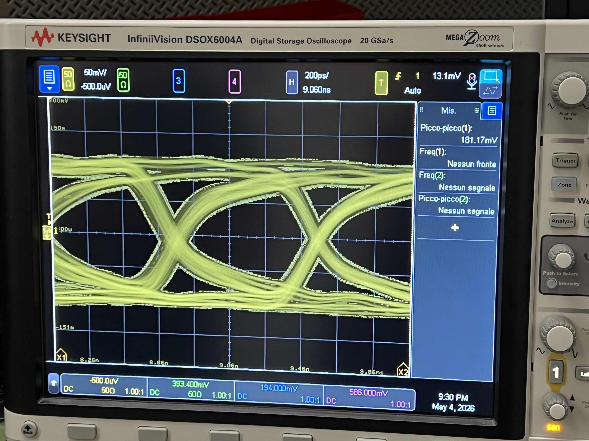
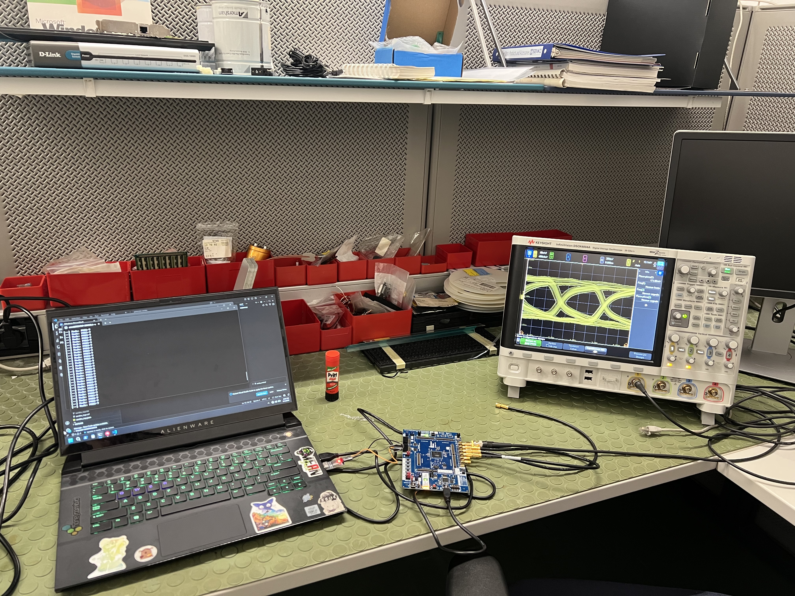

# Oscilloscope Measurements

## Equipment
- **Oscilloscope:** Keysight InfiniiVision DSOX6004A
- **Sample rate:** 20 GSa/s
- **Date:** May 4, 2026

## PRBS-7 Eye Diagram (04_serdes_cmd, PRBS mode)

| Parameter | Value |
|-----------|-------|
| Vertical scale | 50 mV/div |
| Horizontal scale | 200 ps/div |
| Peak-to-peak voltage | 181.17 mV |
| Probe connection | J15 (TX+) single-ended to GND |

## Lab Setup

## Notes
- Only PRBS-7 mode was measured as recommended by supervisor
- Eye diagram shows clear opening confirming good signal integrity
- Line rate can be calculated: f = 1 / T_bit from horizontal scale
